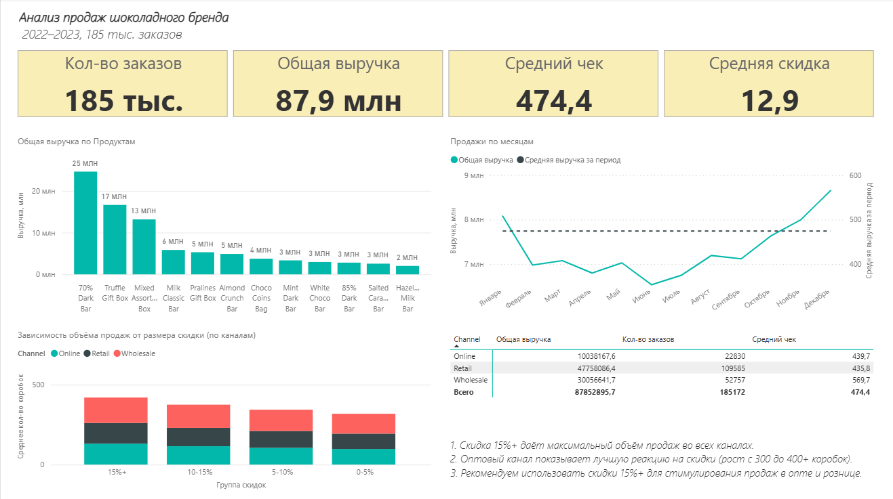

# Анализ продаж шоколадного бренда

## 📊 Данные
- 185 тыс. заказов (2022–2023)
- 7 стран, 12 продуктов, 3 канала продаж

## 🎯 Задачи
1. Посчитать ключевые метрики: выручка, средний чек, средняя скидка
2. Оценить связь между скидкой и объёмом продаж
3. Проанализировать сезонность по месяцам
4. Сравнить эффективность каналов продаж

## 📈 Ключевые выводы
- **Скидка 15%+** даёт максимальный объём продаж во всех каналах
- **Оптовый канал** лучше всего реагирует на скидки (рост с 300 до 400+ коробок)
- Рекомендуем использовать скидки от 15% для стимулирования продаж

## 🛠️ Инструменты
- Power BI (DAX, меры, визуализации)
- Python (Очистка данных)
- SQL

## 📸 Скриншот

## 📂 Файлы
- [chocolate_dashboard.pbix](https://github.com/Stepa555/chocolate-sales-dashboard/blob/main/%D0%90%D0%BD%D0%B0%D0%BB%D0%B8%D0%B7%20%D1%88%D0%BE%D0%BA%D0%BE%D0%BB%D0%B0%D0%B4%D0%B0.pbix) — файл дашборда
